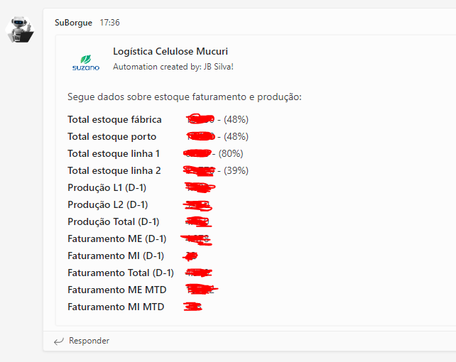

# Projeto

Este arquivo contém um projeto em Python que executa as seguintes funções:

- Efetua login em GPO e extrai os dados de estoque.
- Efetua login em SAPWEB e extrai os seguintes dados:
  - Dados de faturamento do dia anterior.
  - Dados de faturamento do mês.
  - Dados de estoque.
  - Dados de produção.

Os dados são armazenados e enviados via Microsoft Teams e WhatsApp Web.

# Observações
- O projeto foi desenvolvido para uso exclusivo em rede corporativa; algumas funções podem não funcionar fora desta rede.
- Cada programador pode adaptar o projeto para executar outras atividades.

### Mensagem em WhatsApp
- Enviada a 1 pessoa via link direto (URI).
  - 

### Mensagem Microsoft Teams
- Enviada a um grupo de pessoas através da API webhook.
  - 

***Dados privados ocultos***

# RPA-SAPWeb-GPO

Este projeto é um exemplo de automação de processos robóticos que visa extrair dados de estoque e faturamento do SAPWEB e enviá-los via Microsoft Teams e WhatsApp Web.

## Pré-requisitos

Antes de começar, verifique se você atendeu aos seguintes requisitos:

- Você instalou a versão mais recente do Python.
- Você instalou as bibliotecas necessárias listadas no arquivo requirements.txt.

## Instalando RPA-SAPWeb-GPO

Para instalar o RPA-SAPWeb-GPO, siga estas etapas:

1. Clone o repositório.
2. Instale as bibliotecas necessárias listadas no arquivo requirements.txt.

## Usando RPA-SAPWeb-GPO

Para usar RPA-SAPWeb-GPO, siga estas etapas:

1. Execute o arquivo main.py.

## Contribuindo para RPA-SAPWeb-GPO

Para contribuir com RPA-SAPWeb-GPO, siga estas etapas:

1. Faça um fork deste repositório.
2. Crie um branch: `git checkout -b <nome_do_branch>`.
3. Faça suas alterações e confirme-as: `git commit -m '<mensagem_do_commit>'`
4. Envie para o branch original: `git push origin <nome_do_projeto>/<local>`
5. Crie uma solicitação pull.

## Contato

Se você quiser entrar em contato comigo, envie um e-mail para jbsilva.dev@outlook.com.
